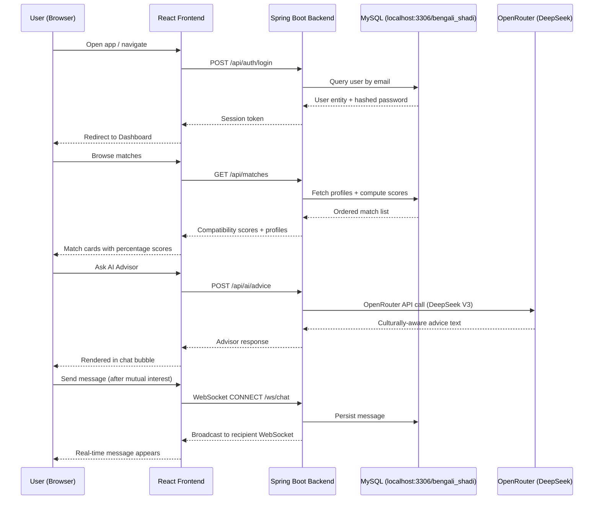
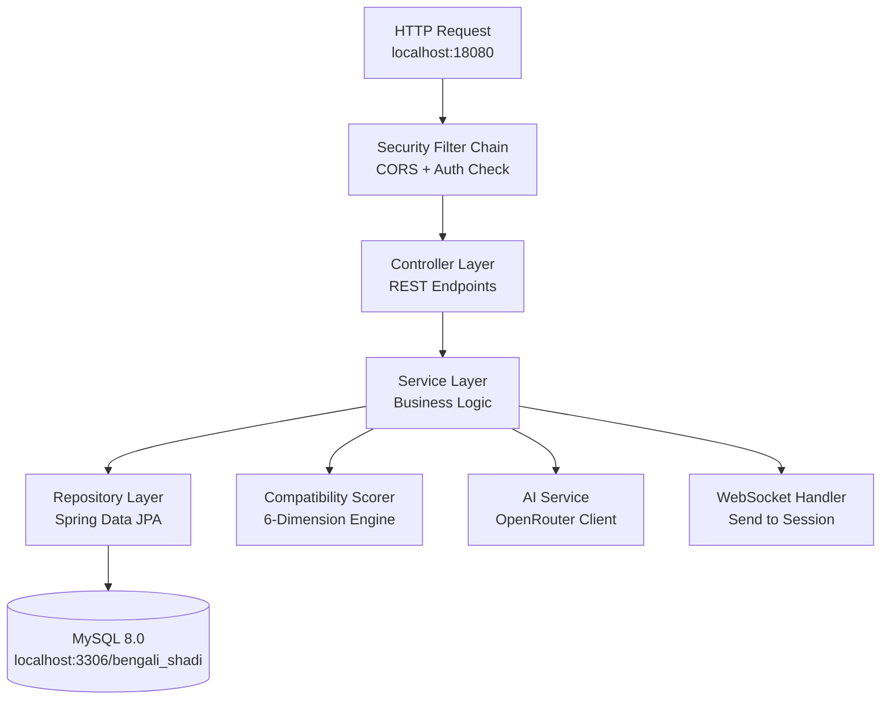

<div align="center">


# 🪔 Bengali Shadi — শুভ বিবাহ

**Where Traditions Meet Tomorrow**

*Traditional Values · Modern Technology · Meaningful Matches*

[](https://spring.io/projects/spring-boot)
[](https://react.dev)
[](https://mysql.com)
[](https://openrouter.ai)
[](#-getting-started-locally)
[](LICENSE)

A full-stack, AI-powered matrimony platform built exclusively for the Bengali community — spanning Hindu, Muslim, Christian, and all Bengali sub-communities.

> 🖥️ **Runs fully locally** — Backend on `localhost:18080`, Frontend on `localhost:5173`, connected to your local MySQL database.

</div>

---

## 📋 Table of Contents

1. [Features](#-features)
2. [Architecture & Pipeline](#-architecture--pipeline)
3. [Tech Stack](#-tech-stack)
4. [Project Structure](#-project-structure)
5. [Compatibility Scoring Engine](#-compatibility-scoring-engine)
6. [Getting Started Locally](#-getting-started-locally)
7. [Environment Variables](#-environment-variables)
8. [API Reference](#-api-reference)
9. [Demo Accounts](#-demo-accounts)
10. [UI Design System](#-ui-design-system)
11. [Contributing](#-contributing)

---

## ✨ Features

| Feature | Description |
|:---|:---|
| 💑 **Smart Matching** | Rule-based compatibility scoring across 6 dimensions — Location, Religion, Lifestyle, Family, Career & Communication |
| 🤖 **AI Marriage Advisor** | OpenRouter-powered AI (DeepSeek Chat V3) providing culturally sensitive, Bangla-aware matchmaking insights |
| 💬 **Gated Private Chat** | Real-time WebSocket messaging, unlocked only after mutual interest is accepted by both parties |
| 🧿 **Bengali-Specific Profiles** | Fields for: district origin, gotra, horoscope sign, dietary preference, dialect, family type, and more |
| 🔒 **Secure Authentication** | PBKDF2-with-HMAC-SHA256 password hashing; JWT-ready session management |
| 📊 **Compatibility Reports** | Auto-generated detailed compatibility breakdown for any matched pair |
| 🖼️ **Profile Photos** | Multipart file upload (up to 10MB) with Tomcat request handling |
| 🔔 **Interest System** | Send/accept/reject interest requests; chat unlocks only after mutual acceptance |
| ⚡ **Local MySQL Support** | Connects to a local MySQL 8.0+ database; schema auto-created by Hibernate on first run |

---

## 🏗️ Architecture & Pipeline

### High-Level System Architecture

```
┌─────────────────────────────────────────────────────────────────────────┐
│                         Bengali Shadi Platform                          │
│                                                                         │
│   ┌──────────────┐    HTTPS / REST     ┌───────────────────────────┐   │
│   │              │ ──────────────────► │                           │   │
│   │  React 19    │                     │   Spring Boot 3.x API     │   │
│   │  (Vite SPA)  │ ◄────────────────── │   (Port 18080)            │   │
│   │              │    JSON responses   │                           │   │
│   │  Port: 5173  │                     │  ┌─────────────────────┐  │   │
│   │  (local)     │                     │  │ Modules:            │  │   │
│   └──────┬───────┘                     │  │  • auth             │  │   │
│          │                             │  │  • profile          │  │   │
│          │ WebSocket (ws://)           │  │  • match            │  │   │
│          │ /ws/chat                    │  │  • connection       │  │   │
│          └────────────────────────────►│  │  • ai               │  │   │
│                                        │  │  • astro            │  │   │
│                                        │  └──────────┬──────────┘  │   │
│                                        └─────────────┼─────────────┘   │
│                                                      │                  │
│                         ┌────────────────────────────┼──────────────┐  │
│                         ▼                            ▼              │  │
│               ┌──────────────────┐      ┌────────────────────┐     │  │
│               │  MySQL 8.0+      │      │  OpenRouter API    │     │  │
│               │  localhost:3306  │      │  (DeepSeek V3)     │     │  │
│               │  bengali_shadi  │      │  AI Advisor        │     │  │
│               │  (Local DB)     │      └────────────────────┘     │  │
│               └──────────────────┘                                  │  │
└─────────────────────────────────────────────────────────────────────┘
```

### Request / Response Data Flow



### Backend Module Pipeline



---

## 🛠️ Tech Stack

### Backend

| Technology | Version | Role |
|:---|:---|:---|
| **Java** | 21 LTS | Primary language |
| **Spring Boot** | 3.4.1 | Application framework |
| **Spring Data JPA** | via Boot | ORM & Repository pattern |
| **Hibernate** | 6.6.4 | JPA implementation |
| **Spring WebSocket** | via Boot | Real-time bi-directional messaging |
| **Spring Security** | via Boot | Auth filter chain & CORS |
| **PBKDF2-HMAC-SHA256** | Built-in | Password hashing |
| **MySQL Connector/J** | 8.0+ | Local MySQL database connectivity |
| **Tomcat** | Embedded | HTTP server (port 18080) |
| **Maven Wrapper** | 3.9+ | Build tool |

### Frontend

| Technology | Version | Role |
|:---|:---|:---|
| **React** | 19 | UI component framework |
| **Vite** | 6.x | Build tool & dev server |
| **Vanilla CSS** | — | Custom design system (no Tailwind) |
| **React Router** | 6.x | Client-side page routing |
| **WebSocket API** | Native | Real-time chat integration |
| **Google Fonts** | — | Playfair Display, Lato |

### AI Integration

| Technology | Role |
|:---|:---|
| **OpenRouter API** | LLM Gateway (OpenAI-compatible endpoint) |
| **DeepSeek Chat V3** | Primary AI model (`deepseek/deepseek-chat-v3-0324`) |

### Local Development Tools

| Technology | Role |
|:---|:---|
| **MySQL 8.0+** | Local relational database (port 3306) |
| **MySQL Workbench** | Optional GUI to browse the `bengali_shadi` DB |
| **GitHub** | Source control |

---

## 📁 Project Structure

```
Bengali Shadi.com/
│
├── 📄 README.md
├── 📄 push_to_github.bat       # Convenience script to push to GitHub
│
├── 🗄️ backend/
│   ├── pom.xml                 # Maven dependencies
│   └── src/main/
│       ├── java/com/bengalishadi/
│       │   ├── BengaliShadiApplication.java   # Entry point
│       │   ├── auth/          # Login, Signup, AuthController
│       │   ├── profile/       # UserProfile entity, repo, service
│       │   ├── match/         # MatchController, CompatibilityScorer
│       │   ├── connection/    # Interest request system
│       │   ├── ai/            # OpenRouter client, AIController
│       │   ├── astro/         # Horoscope compatibility module
│       │   └── config/        # CORS, WebSocket, Security config
│       └── resources/
│           ├── application.properties          # Main config (env-driven)
│           └── application-local.properties    # Git-ignored local secrets
│
└── ⚛️ frontend/
    ├── package.json
    ├── vite.config.js
    └── src/
        ├── main.jsx               # React entry point
        ├── App.jsx                # Router + layout
        ├── index.css              # Global design tokens (nostalgic theme)
        ├── api/
        │   └── client.js          # Fetch base + WebSocket setup
        └── pages/
            ├── LoginPage.jsx
            ├── DashboardPage.jsx
            ├── MatchesPage.jsx
            ├── ProfilePage.jsx
            ├── ChatPage.jsx
            └── AdvisorPage.jsx
```

---

## 📊 Compatibility Scoring Engine

Scores are computed server-side in the `match` module using a weighted 6-dimension model:

| Dimension | Weight | Matching Criteria |
|:---|:---:|:---|
| 🗺️ **Location** | **20%** | Same district → full; same state → partial; different → low |
| 🕌 **Religion** | **15%** | Exact community match; sub-community bonus |
| 🌿 **Lifestyle** | **20%** | Diet (veg/non-veg/eggetarian); daily habits alignment |
| 👨‍👩‍👧 **Family** | **15%** | Joint vs nuclear family preference; sibling count |
| 💼 **Career** | **15%** | Profession category; income expectation compatibility |
| 🗣️ **Communication** | **15%** | Mother tongue (Bengali/English/Hindi); dialect similarity |

> **Score Formula:** `Σ (dimension_score × weight)` — expressed as a percentage (0–100%).

---

## 🚀 Getting Started Locally

### Prerequisites

| Tool | Minimum Version |
|:---|:---|
| **JDK** | 21+ |
| **Node.js** | 18+ |
| **MySQL** | 8.0+ |
| **Maven Wrapper** | Bundled (`./mvnw`) |

### Step 1 — Clone the Repository

```bash
git clone https://github.com/lokojitcoder123/Cokh-tule-dekhona-ke-eseche.git
cd "Cokh-tule-dekhona-ke-eseche"
```

### Step 2 — Create the MySQL Database

Open **MySQL Command Line Client** or **MySQL Workbench** and run:

```sql
CREATE DATABASE IF NOT EXISTS bengali_shadi
  CHARACTER SET utf8mb4
  COLLATE utf8mb4_unicode_ci;
```

Or via terminal:
```cmd
mysql -u root -p -e "CREATE DATABASE IF NOT EXISTS bengali_shadi CHARACTER SET utf8mb4 COLLATE utf8mb4_unicode_ci;"
```

### Step 3 — Configure Secrets (Git-ignored)

Create the file `backend/src/main/resources/application-local.properties`:

```properties
# This file is .gitignore'd — NEVER commit this!

# OpenRouter AI Key
app.ai.api-key=sk-or-v1-YOUR_OPENROUTER_KEY_HERE

# Local MySQL Credentials
DB_USERNAME=root
DB_PASSWORD=your_mysql_password_here
```

> The app will connect to `jdbc:mysql://localhost:3306/bengali_shadi` by default.
> Hibernate auto-creates all tables on first boot via `ddl-auto=update`.

### Step 4 — Start the Backend

```cmd
cd backend
.\mvnw spring-boot:run
```

- ✅ Backend starts on **`http://localhost:18080`**
- ✅ Connects to your local MySQL `bengali_shadi` database
- ✅ All tables auto-created on first run
- ✅ 10 demo profiles seeded automatically

### Step 5 — Start the Frontend

```cmd
cd frontend
npm install
npm run dev
```

- ✅ App opens at **`http://localhost:5173`**

---

## 🔐 Environment Variables

All variables have sensible local defaults. Override them in `application-local.properties` (git-ignored).

| Variable | Default Value | Description |
|:---|:---|:---|
| `PORT` | `18080` | Backend server port |
| `SPRING_PROFILES_ACTIVE` | `local` | Active Spring profile |
| `SPRING_DATASOURCE_URL` | `jdbc:mysql://localhost:3306/bengali_shadi` | Local MySQL JDBC URL |
| `DB_DRIVER` | `com.mysql.cj.jdbc.Driver` | MySQL JDBC driver class |
| `DB_USERNAME` | `root` | MySQL username |
| `DB_PASSWORD` | *(set in local.properties)* | MySQL password — **never commit this** |
| `HIBERNATE_DIALECT` | `org.hibernate.dialect.MySQLDialect` | MySQL Hibernate dialect |
| `APP_CORS_ALLOWED_ORIGINS` | `http://localhost:5173` | Allowed frontend origin for CORS |
| `OPENROUTER_API_KEY` | *(set in local.properties)* | OpenRouter AI API key — **never commit this** |
| `AI_MODEL` | `deepseek/deepseek-chat-v3-0324` | AI model to use |
| `AI_BASE_URL` | `https://openrouter.ai/api/v1` | OpenRouter endpoint |
| `VITE_API_URL` | `http://localhost:18080/api` | Frontend → Backend API base URL |

> 🔒 `application-local.properties` is listed in `.gitignore` — it will never be committed to source control.

---


## 📡 API Reference

### Auth Endpoints

| Method | Endpoint | Description |
|:---|:---|:---|
| `POST` | `/api/auth/signup` | Register a new user |
| `POST` | `/api/auth/login` | Login and receive session token |

### Profile Endpoints

| Method | Endpoint | Description |
|:---|:---|:---|
| `GET` | `/api/profiles/me` | Get your own profile |
| `PUT` | `/api/profiles/me` | Update profile details |
| `POST` | `/api/profiles/me/photo` | Upload profile photo (multipart, max 10MB) |
| `GET` | `/api/profiles/{id}` | View another user's profile |

### Match Endpoints

| Method | Endpoint | Description |
|:---|:---|:---|
| `GET` | `/api/matches` | Get ordered list of matches with scores |
| `GET` | `/api/matches/{id}/report` | Get detailed compatibility report |

### Connection Endpoints

| Method | Endpoint | Description |
|:---|:---|:---|
| `POST` | `/api/connections/interest/{profileId}` | Send interest to a profile |
| `PUT` | `/api/connections/{id}/accept` | Accept a received interest |
| `PUT` | `/api/connections/{id}/reject` | Reject an interest |
| `GET` | `/api/connections` | List all connections and statuses |

### AI Advisor Endpoint

| Method | Endpoint | Description |
|:---|:---|:---|
| `POST` | `/api/ai/advice` | Ask the AI Marriage Advisor |

### WebSocket

| Event | Channel | Description |
|:---|:---|:---|
| Connect | `ws://{host}/ws/chat` | Establish real-time session |
| Send | `SEND /app/chat/{roomId}` | Send a message to a connection |
| Subscribe | `SUBSCRIBE /topic/chat/{roomId}` | Receive messages in real time |

---

## 👥 Demo Accounts

All demo accounts use the password: **`Password@123`**

| Name | Email | Community | City |
|:---|:---|:---|:---|
| Ananya Chatterjee | `ananya@demo.com` | Hindu · Kayastha | Kolkata |
| Fatima Khatun | `fatima@demo.com` | Muslim · Sunni | Howrah |
| Priya Sen | `priya@demo.com` | Hindu · Brahmin | Siliguri |
| Rima Das | `rima@demo.com` | Hindu · Kayastha | Kolkata |
| Nusrat Jahan | `nusrat@demo.com` | Muslim · Sunni | Murshidabad |
| Arjun Banerjee | `arjun@demo.com` | Hindu · Brahmin | Kolkata |
| Rahim Sheikh | `rahim@demo.com` | Muslim · Sunni | Murshidabad |
| Sourav Ghosh | `sourav@demo.com` | Hindu · Kayastha | Kolkata |
| Imran Ali | `imran@demo.com` | Muslim · Sunni | Burdwan |
| Debojit Roy | `debojit@demo.com` | Hindu · Kayastha | Asansol |

---

## 🎨 UI Design System

The nostalgic Bengali wedding aesthetic is driven by CSS custom properties in `frontend/src/index.css`:

```css
:root {
  /* Colour Palette */
  --color-parchment: #FFF8F0;   /* Page background — aged ivory     */
  --color-linen:     #F5ECD7;   /* Card background — warm linen     */
  --color-sindoor:   #B22234;   /* Primary action — sindoor red     */
  --color-marigold:  #D4A017;   /* Accent — marigold gold           */
  --color-turmeric:  #C8860A;   /* Hover state gold                 */
  --color-ink:       #1A0A00;   /* Body text — warm near-black      */
  --color-faded:     #6B4C3B;   /* Muted text — aged sepia          */

  /* Typography */
  --font-heading: 'Playfair Display', Georgia, serif;
  --font-body:    'Lato', system-ui, sans-serif;

  /* Radii & Shadows */
  --radius-card:  12px;
  --shadow-card:  0 4px 24px rgba(178, 34, 52, 0.08);
}
```

**Inspirations:** Traditional Bengali wedding invitation cards, silk-bordered *sharee* patterns, *alpona* floor art, and the warm amber glow of diya lamps.

---

## 🤝 Contributing

1. **Fork** the repository
2. Create a feature branch: `git checkout -b feature/your-feature-name`
3. Commit your changes: `git commit -m "feat: your feature description"`
4. Push to the branch: `git push origin feature/your-feature-name`
5. Open a **Pull Request**

> Please ensure all secret keys remain in `application-local.properties` and are never committed.

---

<div align="center">

**Built with ❤️ for Bengal**

*Real Connections · Rooted in Culture · Lifelong Bonds*

[](https://github.com/lokojitcoder123/Cokh-tule-dekhona-ke-eseche)

</div>
